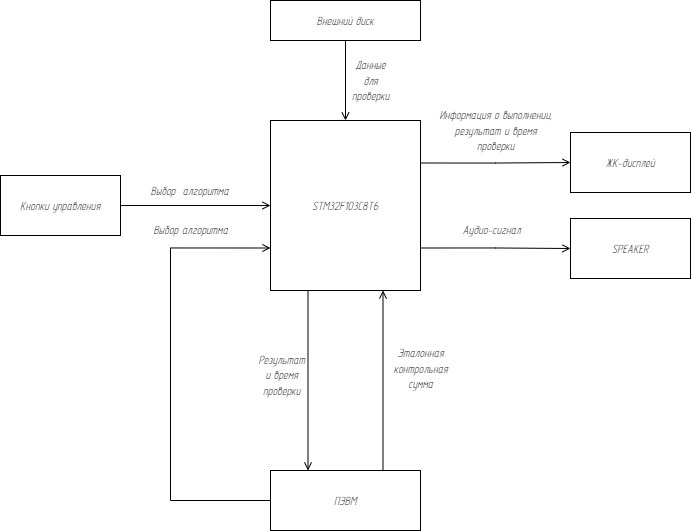

## Устройство для провверки контрольной суммы - курсовая работа по МПС
> Студент ИУ6-74Б Коптелев Кирилл
## Задание:
Разработать МК-систему для проверки целостности данных на внешнем диске. Эталонная
контрольная сумма передается оператором с ПЭВМ, Реализовать несколько алгоритмов для
подсчета контрольной суммы диска и сравнения с эталонной. Предусмотреть возможность
выбора алгоритма с помощью кнопок управления и ПЭВМ. Результат и время проверки
выводить на ЖК-дисплей и ПЭВМ, При несовпадении контрольных сумм выдавать
соответствующий аудио сигнал на SPEAKER,
Выбрать наиболее оптимальный вариант МК, Выбор обосновать
Разработать схему, алгоритмы и программу. Отладить проект в симуляторе или на макете.
Оценить потребляемую мощность. Описать принципы и технологию программирования
используемого микроконтроллера.

## Структурная схема:
Согласно заданию была создана структурная схема, отображающая общую структуру разрабатываемой МПС:

## Компоненты:
Итого нужны следующие компоненты:
- Микроконтроллер;
- ЖК-дисплей;
- ПЭВМ;
- Спикер;
- Две или больше кнопок;
- Внешний диск.
